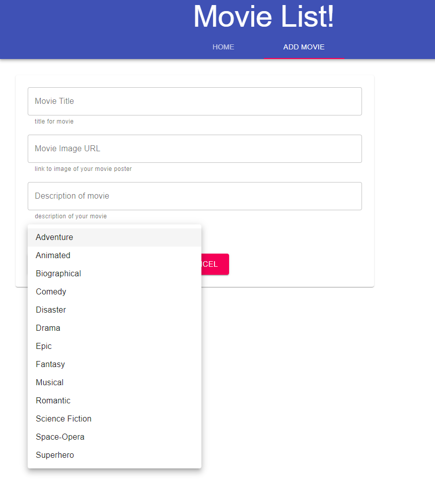

# Movie Sagas

## Description

Simply movie gallery application that allows you to add movies to your gallery along genres. You can view more details about the movie simply by clicking on the information icon on each movie. This app was made to practice join database queries, redux, sagas, REST, and styling.

_Duration: 4 hours_

## Built With

React, Redux, PG, PostgreSQL Node, Express, Axios, React-Saga, React-Router, Material-UI

## Screen Shot

## Database Setup

1. Create a database named `saga_movies_weekend`
2. Run the queries from `database.sql` on the `saga_movies_weekend` database.
3. A movie could have many genres. You will need to create the junction table between the `movies` and `genres` tables! It will be helpful to have some data for that junction table added.

## Install Dependencies

1. `npm install`
2. `npm run server`
3. `npm run client`
